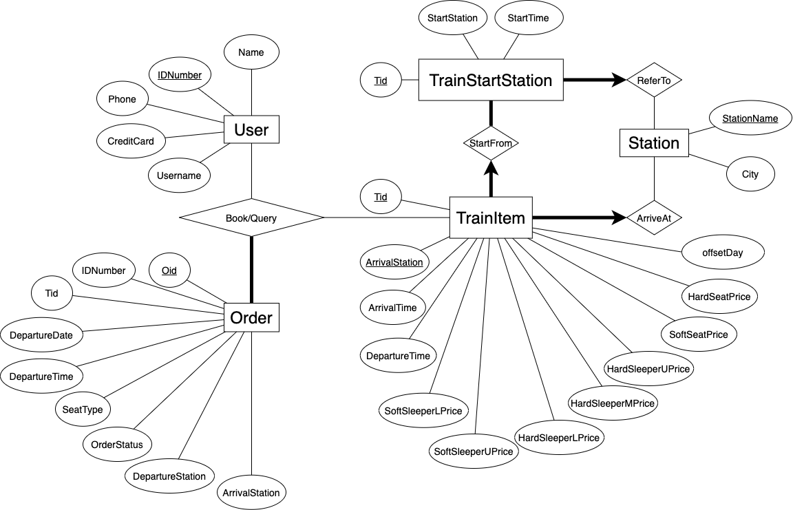

# 设计报告 1: 12306 订票系统数据库关系模式

<h2>报告大纲</h2>

[toc]

## 实体-联系图: 范式细化前

## 范式细化

## 关系模式

## 成员分工

<!-- GitHub版本不要写学号信息! 只写在GitHub公开过的信息! -->

- [Xuzhou Zheng](https://github.com/chuan-325):
- [Wenyi Fu](https://github.com/FuWenyi):
- [Zixuan Lu](https://github.com/birepeople):
