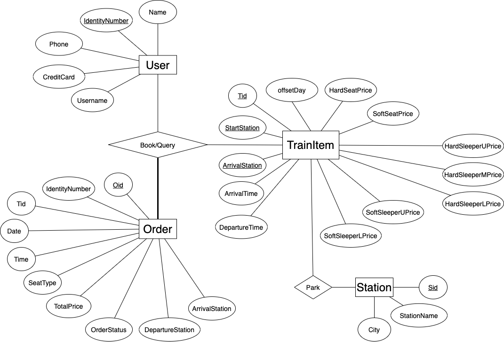
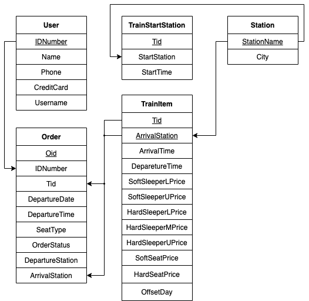

# 设计报告 1: 订票系统的数据库关系模式

<h2>报告大纲</h2>

[toc]

## 描述实体联系：ER 图

分析该数据库需要囊括的信息，我们得到以下的实体-联系图：



该图中仍然具有一些明显的冗余部分，故而需要通过范式细化去冗余。

## 范式细化

为了尽量减少数据冗余，我们需要对形成的关系模型进行范式分析、模式分解。在本项目中，具体的目标是使实体联系满足 BCNF，为此需要检查并消除关系模型中的：

- 部分依赖
- 非键传递依赖
- 对于键属性的传递依赖

当以上 3 种依赖都消除时，该关系模型即满足 BCNF.

下面对各个主体依次进行有关范式的判断与分析。

### User

**候选键**：IdentityNumber, Phone.

**非键属性**：Name, CreditCard, Username.

**依赖关系**:

```
(1) IdentityNumber -> Name Phone CreditCard Username
(2) Phone -> Name IdentityNumber CreditCard Username
```

**范式判断**：User 满足 BCNF.

### Order

**候选键**：Oid

**非键属性**：Tid, IdentityNumber, Day, Time, TotalPrice, SeatType, OrderStatus, DepartureStation, ArrivalStation .

**依赖关系**：

```
(1) Oid -> Tid IdentityNumber Day Time TotalPrice SeatType OrderStatus DepartureStation ArrivalStation
(2) Tid DepatureStation ArrivalStation SeatType -> TotalPrice
```

**范式判断**：依赖关系 (2) 为非键传递依赖，因此 Order 满足 2NF.

**消除依赖**：删除 TotalPrice 项，因为价格可以通过连接 TrainItem 表查找得到。

### Station

**候选键**：Sid, (StationName, City)

**非键属性**：无。

**依赖关系**：

```
(1) Sid -> StationName City
(2) StationName City ->Sid
```

**范式判断**：Station 满足 BCNF.

此外，在分析时我们发现老师提供的车站序号 Sid 在真实计算过程中是多余的，于是将该属性删除。

### TrainItem

**候选键**：(Tid, StartStation, ArrivalStation)

**非键属性**：ArrivalTime, DepartureTime, HardSealPrice, SoftSeatPrice, HardSleeperUPrice, HardSleeperMprice, HardSleeperLPrice, SoftSleeperUPrice, SoftSleeperLPrice, OffsetDay.

**依赖关系**：

```
(1) Tid StartStation ArrivalStation -> ArrivalTime DepartureTime HardSealPrice SoftSeatPrice HardSleeperUPrice HardSleeperMprice HardSleeperLPrice SoftSleeperUPrice SoftSleeperLPrice
(2) Tid ArrivalStation -> ArrivalTime DepartureTime HardSealPrice SoftSeatPrice HardSleeperUPrice HardSleeperMprice HardSleeperLPrice SoftSleeperUPrice SoftSleeperLPrice
(3) Tid -> StartStation
```

**范式判断**：依赖关系 (2) 是部份依赖，依赖关系 (3) 是对于键属性的函数依赖；由前者即知 TrainItem 满足 1NF.

**消除依赖**：

1. 将 TrainIterm 表分解为以下两个部分:
   - $\rm \pi_{(Tid,StartStation)}TrainItem$:作为一个新主体，被命名为 TrainStartStation；
   - $\rm \pi_{(Tid, AS, AT, DT, HSP, SSP, HSUP, HSMP, HSLP, SSUP, SSLP)}Train Item$: 删除 StartStation 项，并保持原名 TrainIterm；
2. 两表以车次的起始站相联系；这个分解为无损分解，分解后两表均满足 BCNF.

## 修正后的 ER 图

对原本的 ER 图依次进行以下操作:

1. 进行范式细化;
2. 为了增加可读性, 微调一些属性和联系的名称;
3. 原图缺少始发站发车时间, 在 TrainStartStation 实体中添加 StartTime 这一属性, 再度进行范式细化等判断, 必要时消除依赖;

得到如下的 ER 图:


### 实体/联系/属性的详细释义

#### User/ 用户

- Name: 乘客姓名
- IDNumber: 乘客身份证号
- Phone: 用户手机号
- CreditCard: 用户付款卡号
- Username: 用户账户名

#### Order/ 订单

- Oid: 订单号
- IDNumber: 乘客身份证号
- Tid: 车次
- DepartureDate: 行程出发日期
- DepartureTime: 行程出发时间
- SeatType: 票种
- OrderStatus: 订单状态
- DepartureStation: 出发车站
- ArrivalStation: 到达车站

#### TrainItem/ 从始发站到某一站的列车行程

- Tid: 车次
- ArrivalStation: 到达车站
- ArrivalTime: 到站时间
- DepartureTime: 离站时间
- SoftSleeperLPrice: 软卧下铺票价
- SoftSleeperUPrice: 软卧上铺票价
- HardSleeperLPrice: 硬卧下铺票价
- HardSleeperMPrice: 硬卧中铺票价
- HardSleeperUPrice: 硬卧上铺票价
- SoftSeatPrice: 软座票价
- HardSeatPrice: 硬座票价
- OffsetDay: 中间车站与始发站的时间

#### TrainStartStation/ 车次始发站

- Tid: 车次
- StartStation: 始发站站名
- StartTime: 始发站发车时间

#### Station/ 车站

- StationName: 车站名
- City: 车站所在城市

## 关系模式

考虑该数据库应具有的外键约束、完整性约束等，仿照 TPCH 文档，画出的关系模式图如下：



以下的 create table 语句可以代替说明具体的关系模式:

```sql
create table stations(
	s_stationname varchar(20) primary key,
	s_city        varchar(20) not null
	);

create table users(
	u_idnumber    char(18) primary key,
	u_name        varchar(20) not null,
	u_phone       char(11) not null,
	u_creditcard  char(16) not null,
	u_username    varchar(20) not null,
    unique(u_phone)
	);

create table trainstartstations(
	tss_tid          varchar(5) primary key,
	tss_startstation varchar(20) not null,
	tss_starttime    time not null,
	foreign key(tss_startstation) references stations(s_stationname)
	);

create table trainitems(
	ti_tid            varchar(5),
	ti_arrivalstation varchar(20),
	ti_arrivaltime    time default time '00:00:00',
	ti_departuretime  time default time '00:00:00',
	ti_sslprice       float  default 0,
	ti_ssuprice       float  default 0,
	ti_hslprice       float  default 0,
	ti_hsmprice       float  default 0,
	ti_hsuprice       float  default 0,
	ti_sseprice       float  default 0,
	ti_hseprice       float  default 0,
  ti_offsetday      integer default 0,
	primary key(ti_tid, ti_arrivalstation),
	foreign key(ti_arrivalstation) references stations(s_stationname)
	);

create type seat_t as enum ('ssl','ssu','hsl','hsm','hsu','sse', 'hse');
create type stat_t as enum ('cancelled', 'expired', 'valid');

create table orders(
	o_oid              char(15) primary key,
	o_idnumber         char(18) not null,
	o_tid              varchar(5) not null,
	o_departuredate    date not null,
	o_departuretime    time not null,
	o_seattype         seat_t not null,
	o_orderstatus      stat_t default 'valid',
	o_departurestation varchar(20) not null,
	o_arrivalstation   varchar(20) not null,
	foreign key(o_idnumber) references users(u_idnumber),
  foreign key(o_tid, o_arrivalstation) references trainitems(ti_tid, ti_arrivalstation)
	);
```

## 成员分工

<!-- GitHub 版本不要写学号信息! 只写在 GitHub 公开过的信息! -->

- [Xuzhou Zheng](https://github.com/chuan-325): ER 图修订, 关系模式图修订, 报告整合
- [Wenyi Fu](https://github.com/FuWenyi): ER 图绘制, 范式细化
- [Zixuan Lu](https://github.com/birepeople): 关系模式图绘制
