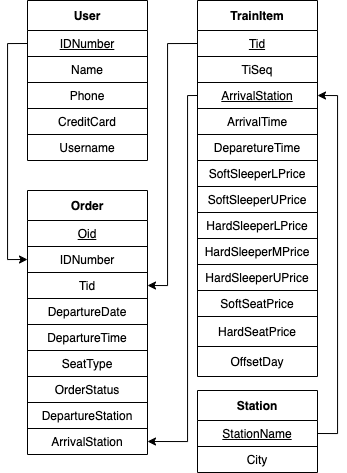
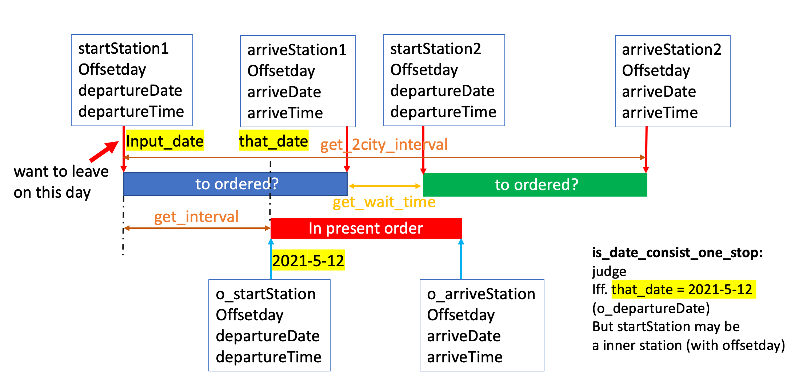
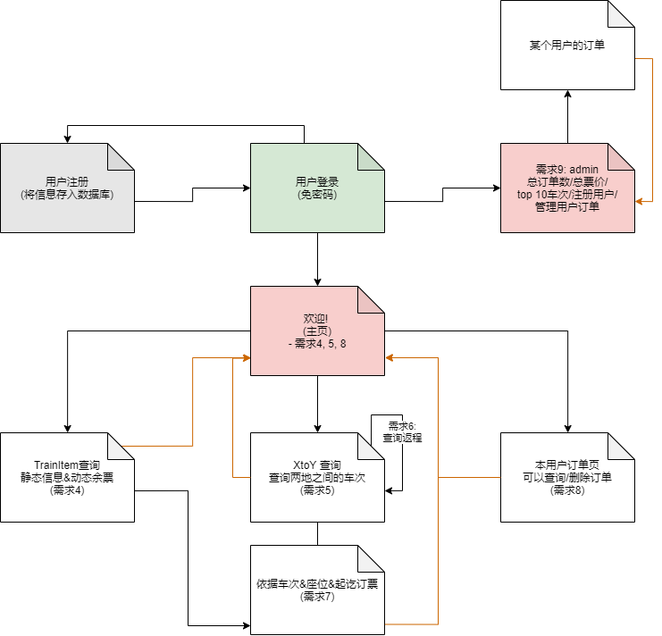

# 最终报告 : 基于 django-psql 的铁路订票系统

## 基本功能描述

### table 设计回顾

 在本项目前期，我们使用了单独的表记录（车次、起始站、终点站、发车时间）这组与中间站无关的信息，但在实际实现的时候，通过对车次数据的特殊处理，我们最终放弃使用单独的表记录，可避免一定的连接过程。

 最终使用的表如下所示：

| tablename  |                                                                                    field                                                                                     | column_count |     comment     |
| :--------: | :--------------------------------------------------------------------------------------------------------------------------------------------------------------------------: | :----------: | :-------------: |
|   orders   |                         o_oid, o_idnumber, o_tid, o_departuredate, o_departuretime, o_seattype, o_orderstatus, o_departurestation, o_arrivalstation                          |      9       |    订单信息     |
|  stations  |                                                                            s_stationname, s_city                                                                             |      2       | 站名-城市名信息 |
| trainitems | ti_tid, ti_seq, ti_arrivalstation, ti_arrivaltime, ti_departuretime, ti_hseprice, ti_sseprice, ti_hsuprice, ti_hsmprice, ti_hslprice, ti_ssuprice, ti_sslprice, ti_offsetday |      13      |    车次信息     |
|   users    |                                                            u_idnumber, u_name, u_phone, u_creditcard, u_username                                                             |      5       |    用户信息     |

在 trainitems 的座位这个属性以及订单的状态属性中，我们使用了定义的枚举类：

```sql
create type seat_t as enum ('ssl','ssu','hsl','hsm','hsu','sse', 'hse');
create type stat_t as enum ('cancelled', 'expired', 'valid');
```

#### schema（更新后）



### create table 模版

```sql
-- create tables

create table stations(
	s_stationname varchar(20) primary key,
	s_city        varchar(20) not null
	);

create table users(
	u_idnumber    char(18) primary key,
	u_name        varchar(20) not null,
	u_phone       char(11) not null,
	u_creditcard  char(16) not null,
	u_username    varchar(20) not null,
    unique(u_phone)
	);

create table trainitems(
	ti_tid            varchar(5),
    ti_seq            integer not null,
	ti_arrivalstation varchar(20) not null,
	ti_arrivaltime    time default time '00:00:00',
    -- 后续考虑arrival和departure时间恰好分属两天的情况，体现在offsetday
	ti_departuretime  time default time '00:00:00',
    -- 硬座
	ti_hseprice       float  default 0,
    -- 软座
	ti_sseprice       float  default 0,
    -- 硬卧 上-中-下
	ti_hsuprice       float  default 0,
	ti_hsmprice       float  default 0,
    ti_hslprice       float  default 0,
    -- 软卧 上-下
	ti_ssuprice       float  default 0,
	ti_sslprice       float  default 0,
	ti_offsetday      integer default 0,
	primary key(ti_tid, ti_arrivalstation),
	foreign key(ti_arrivalstation) references stations(s_stationname)
	);

create table orders(
	o_oid              char(15) primary key,
	o_idnumber         char(18) not null,
	o_tid              varchar(5) not null,
	o_departuredate    date not null,
	o_departuretime    time not null,
	o_seattype         seat_t not null,
	o_orderstatus      stat_t default 'valid',
	o_departurestation varchar(20) not null,
	o_arrivalstation   varchar(20) not null,
	foreign key(o_idnumber) references users(u_idnumber),
	foreign key(o_tid, o_arrivalstation) references trainitems(ti_tid, ti_arrivalstation)
	);
```

### 函数分类

将 sql 查询语句所调用的函数分为功能函数与 utility，其中功能函数返回带有需求中所需的数据，而 utility 主要用于进行必要计算、掩模、转换。

#### 功能函数

|        routines_name         |                                                 input                                                  |               Usage               |
| :--------------------------: | :----------------------------------------------------------------------------------------------------: | :-------------------------------: |
|         city_to_city         |              (departure_city varchar(20), arrive_city varcharr(20), departure_time time)               |   城市-城市匹配站点静态信息查询   |
|    city_to_city_one_stop     |                       (citystart varchar(20), cityto varchar(20), inputime time)                       | 城市-城市一次中转站点静态信息查询 |
| city_to_city_one_stop_total  |          (start_city varchar(20), arrive_city varchar(20), input_time time, input_date date)           | 需求 5 一次中转主函数，考虑了排序 |
| city_to_city_none_stop_total |          (start_city varchar(20), arrive_city varchar(20), input_time time, input_date date)           |    需求 5 直达主函数，考虑排序    |
|    ctc_remaining_tickets     | (match_tid varchar(5), start_seq integer, terminal_seq integer, departure_date date, seat_type seat_t) |         城市-城市查询余票         |
|       remaining_ticket       |                          (tid varchar(5), order_date date, seat_type seat_t)                           |           需求 4 主函数           |

- city_to_city

```sql
create function city_to_city(departure_city character varying, arrive_city character varying, departure_time time without time zone)
    returns TABLE(start_dayoffset integer, arrival_dayoffset integer, match_tid character varying, start_time time without time zone, arrive_time time without time zone, start_seq integer, start_station character varying, terminal_seq integer, terminal_station character varying, hse double precision, sse double precision, hsu double precision, hsm double precision, hsl double precision, ssu double precision, ssl double precision)
    language plpgsql
as
$$
begin
return query
select
    T1.ti_offsetday,
    T2.ti_offsetday,
    T1.ti_tid,
    T1.ti_departuretime as start_time,
    T2.ti_arrivaltime as arrive_time,
    T1.ti_seq as start_seq,
    T1.ti_arrivalstation as start_station,
    T2.ti_seq as terminal_seq,
    T2.ti_arrivalstation as terminal_station,
    (T2.ti_hseprice - T1.ti_hseprice) as hse,
    (T2.ti_sseprice - T1.ti_sseprice) as sse,
    (T2.ti_hsuprice - T1.ti_hsuprice) as hsu,
    (T2.ti_hsmprice - T1.ti_hsmprice) as hsm,
    (T2.ti_hslprice - T1.ti_hslprice) as hsl,
    (T2.ti_ssuprice - T1.ti_ssuprice) as ssu,
    (T2.ti_sslprice - T1.ti_sslprice) as ssl
from
    trainitems as T1,
    trainitems as T2,
    stations as S1,
    stations as S2
where T1.ti_tid = T2.ti_tid
    and S1.s_stationname = T1.ti_arrivalstation
    and S2.s_stationname = T2.ti_arrivalstation
    and S1.s_city = departure_city
    and S2.s_city = arrive_city
    and T2.ti_seq > T1.ti_seq
    and T1.ti_departuretime > departure_time;
end
$$;
```

- city_to_city_one_stop

```sql
create function city_to_city_one_stop(citystart character varying, cityto character varying, inputime time without time zone)
    returns TABLE(func_tid1 character varying, func_start1_offset_day integer, func_arrive1_offset_day integer, func_start2_offset_day integer, func_arrive2_offset_day integer, func_t1start_time time without time zone, func_t1arrive_time time without time zone, func_t1start_seq integer, func_t1start_station character varying, func_t1arrive_seq integer, func_t1arrive_station character varying, func_hse1 double precision, func_sse1 double precision, func_hsu1 double precision, func_hsm1 double precision, func_hsl1 double precision, func_ssu1 double precision, func_ssl1 double precision, func_tid2 character varying, func_t2start_time time without time zone, func_t2arrive_time time without time zone, func_t2start_seq integer, func_t2start_station character varying, func_t2arrive_seq integer, func_t2arrive_station character varying, func_hse2 double precision, func_sse2 double precision, func_hsu2 double precision, func_hsm2 double precision, func_hsl2 double precision, func_ssu2 double precision, func_ssl2 double precision)
    language plpgsql
as
$$
begin
return query
select
    T1start.ti_tid,
    T1start.ti_offsetday,
    T1arrive.ti_offsetday,
    T2start.ti_offsetday,
    T2arrive.ti_offsetday,
    T1start.ti_departuretime as T1start_time,
    T1arrive.ti_arrivaltime as T1arrive_time,
    T1start.ti_seq as T1start_seq,
    T1start.ti_arrivalstation as T1start_station,
    T1arrive.ti_seq as arrive_seq,
    T1arrive.ti_arrivalstation as T1arrive_station,
    (T1arrive.ti_hseprice - T1start.ti_hseprice) as hse,
    (T1arrive.ti_sseprice - T1start.ti_sseprice) as sse,
    (T1arrive.ti_hsuprice - T1start.ti_hsuprice) as hsu,
	(T1arrive.ti_hsmprice - T1start.ti_hsmprice) as hsm,
    (T1arrive.ti_hslprice - T1start.ti_hslprice) as hsl,
	(T1arrive.ti_ssuprice - T1start.ti_ssuprice) as ssu,
	(T1arrive.ti_sslprice - T1start.ti_sslprice) as sslp,
    T2start.ti_tid,
    T2start.ti_departuretime as T2start_time,
    T2arrive.ti_arrivaltime as T2arrive_time,
    T2start.ti_seq as T2start_seq,
    T2start.ti_arrivalstation as T2start_station,
    T2arrive.ti_seq as arrive_seq,
    T2arrive.ti_arrivalstation as T2arrive_station,
    (T2arrive.ti_hseprice - T2start.ti_hseprice) as hse,
    (T2arrive.ti_sseprice - T2start.ti_sseprice) as sse,
    (T2arrive.ti_hsuprice - T2start.ti_hsuprice) as hsu,
	(T2arrive.ti_hsmprice - T2start.ti_hsmprice) as hsm,
    (T2arrive.ti_hslprice - T2start.ti_hslprice) as hsl,
	(T2arrive.ti_ssuprice - T2start.ti_ssuprice) as ssu,
	(T2arrive.ti_sslprice - T2start.ti_sslprice) as sslp
from
    trainitems as T1start,
    trainitems as T1arrive,
    trainitems as T2start,
    trainitems as T2arrive,
    stations as S1s,
    stations as S1a,
    stations as S2s,
    stations as S2a
where
    S1s.s_stationname = T1start.ti_arrivalstation
    and S1a.s_stationname = T1arrive.ti_arrivalstation
    and S2s.s_stationname = T2start.ti_arrivalstation
    and S2a.s_stationname = T2arrive.ti_arrivalstation
    and S2a.s_stationname != S1a.s_stationname
    and S1s.s_city = cityStart
    and S2a.s_city = cityTo
    and T1start.ti_tid != T2start.ti_tid
    and T1start.ti_tid = T1arrive.ti_tid
    and T2start.ti_tid = T2arrive.ti_tid
    and S1a.s_city = S2s.s_city
    and T1arrive.ti_seq > T1start.ti_seq
    and T2arrive.ti_seq > T2start.ti_seq
    and T2start.ti_departuretime <=  T1arrive.ti_arrivaltime + interval '4 hour'
    and     (
            (T1arrive.ti_arrivalstation = T2start.ti_arrivalstation
            and T2start.ti_departuretime >= T1arrive.ti_arrivaltime + interval '1 hour')
        or
            (T1arrive.ti_arrivalstation != T2start.ti_arrivalstation
            and T2start.ti_departuretime >= T1arrive.ti_arrivaltime + interval '2 hour')
            )
    and T1start.ti_departuretime > inputime;
end
$$;
```

- ctc_remaining_tickets

```sql
create function ctc_remaining_tickets(match_tid character varying, start_seq integer, terminal_seq integer, departure_date date, seat_type seat_t)
    returns TABLE(match__tid character varying, remaining bigint)
    language plpgsql
as
$$
begin
if not exists(
    select
        match_tid,
        5 - count(*) as Remaining
    from
        orders,
        (
        select
            ti_tid,
            ti_arrivalstation,
            ti_seq
        from
            trainitems
        )as Seq1,
        (
        select
            ti_tid,
            ti_arrivalstation,
            ti_seq
        from
            trainitems
        )as Seq2
    where
        o_tid = Seq1.ti_tid
        and o_departurestation = Seq1.ti_arrivalstation
        and o_tid = Seq2.ti_tid
        and o_arrivalstation = Seq2.ti_arrivalstation
        and o_tid = match_tid
        and is_date_consist_one_stop(o_departuredate,departure_date,match_tid, o_departurestation,start_seq)
        and o_seattype = seat_type
        and not(
            Seq1.ti_seq >= terminal_seq
            or
            Seq2.ti_seq <= start_seq)
    group by match_tid)
then
return query
select
    match_tid,
    case
    when get_seat_type_not_have(match_tid, start_seq, seat_type) or get_seat_type_not_have(match_tid, terminal_seq, seat_type)
        then 0::bigint
    else 5::bigint
    end;
else
return query
select
    total.match_tid,
    case
    when get_seat_type_not_have(total.match_tid, start_seq, seat_type) or get_seat_type_not_have(total.match_tid, terminal_seq, seat_type)
        then 0
    else total.Remaining end
from
    (select
        match_tid,
        5 - count(*) as Remaining
    from
        orders,
        (
        select
            ti_tid,
            ti_arrivalstation,
            ti_seq
        from
            trainitems
        )as Seq1,
        (
        select
            ti_tid,
            ti_arrivalstation,
            ti_seq
        from
            trainitems
        )as Seq2
    where
        o_tid = Seq1.ti_tid
        and o_departurestation = Seq1.ti_arrivalstation
        and o_tid = Seq2.ti_tid
        and o_arrivalstation = Seq2.ti_arrivalstation
        and o_tid = match_tid
        and is_date_consist_one_stop(o_departuredate,departure_date,match_tid, o_departurestation,start_seq)
        and o_seattype = seat_type
        and not(
            Seq1.ti_seq >= terminal_seq
            or
            Seq2.ti_seq <= start_seq)
    group by match_tid) as total;
end if;
end
$$;

```

#### utility

|      routines_name       | input                                                                                                                                                                                    | output     | type     | usage     | comment                                                              |
| :----------------------: | ---------------------------------------------------------------------------------------------------------------------------------------------------------------------------------------- | ---------- | -------- | --------- | -------------------------------------------------------------------- |
|     is_date_consist      | (departure_date date, order_date date, tid varchar(5), departure_station varchar(20))                                                                                                    | 是否冲突   | boolean  | 需求 4    | 默认出发站为始发站情况下的订单日期与订票日期冲突判断                 |
| is_date_consist_one_stop | (departure_date date, order_date date, tid varchar(5), departure_station varchar(20), start_seq integer)                                                                                 | 是否冲突   | boolean  | 需求 5    | 给定出发站、始发站的订单日期与订票日期冲突判断                       |
|      get_wait_time       | (arrive_time_station1 time, start_time_station2 time)                                                                                                                                    | 时间差     | interval | 需求 5    | 从可能跨天的时刻得到时间差                                           |
|       get_interval       | (start_dayoffset integer, arrival_dayoffset integer, start_time time, arrive_time time)                                                                                                  | 时间差     | interval | 需求 5    | 从起始与到达的 dayoffset、和时刻得到可能跨天的时间差                 |
|    get_2city_interval    | (start1_day_offset integer, arrive1_day_offset integer, start2_day_offset integer, arrive2_day_offset integer, start1_time time, arrive1_time time, start2_time time, arrive2_time time) | 时间差     | interval | 需求 5    | 计算两个城市（站点）间的总历时                                       |
|   get_price_proccessed   | (remaining_ticket_num bigint, seat_price float)                                                                                                                                          | 票价       | float    | 需求 5    | 给定余票，如果余票为 0，则票价转化为最大值（设定为 10000）           |
|   get_processed_price    | (number float)                                                                                                                                                                           | 票价       | float    | 需求 5    | 把票价为 0、为负的转化为最大票价（设定为 10000）                     |
|   get_2price_processed   | (remaining1 bigint, remaining2 bigint, seat_price1 float, seat_price2 float)                                                                                                             | 票价       | float    | 需求 5    | 给定两余票，任意一余票为 0，则两张票票票价转化为最大（设定为 10000） |
|    get_cheapest_price    | (ssl float, ssu float, hsl float, hsm float, hsu float, sse float, hse float)                                                                                                            | 票价       | float    | 需求 5    | 得到 7 种座位中最便宜的票价                                          |
|  get_seat_type_not_have  | (tid varchar(5), seq integer, seat_type seat_t)                                                                                                                                          | 有无某座位 | boolean  | 需求 4、5 | 得到没有某种座位                                                     |

一些时间的处理的函数非常复杂，其关系可以见下图所示，这些都是因为有些车的行程是跨了天的，所以需要预处理 offsetday 字段：



#### utility 函数实现：

- is_date_consist

  ```sql
  create function is_date_consist(departure_date date, order_date date, tid character varying, departure_station character varying) returns boolean
      language plpgsql
  as
  $$
  begin
          return (select ti_offsetday from trainitems
          where   ti_tid = tid
              and ti_arrivalstation = departure_station
              and ti_offsetday = departure_date - order_date
                 )is not null;
      end
  $$;

  ```

- is_date_consist_one_stop

  ```sql
  create function is_date_consist_one_stop(departure_date date, order_date date, tid character varying, departure_station character varying, start_seq integer) returns boolean
      language plpgsql
  as
  $$
  begin
          return (select
                      tid
                  from
                      (select
                          ti_tid,
                          ti_arrivalstation,
                          ti_offsetday
                      from
                          trainitems)
                      as train_station_day,
                      (select
                          ti_tid,
                          ti_seq,
                          ti_offsetday
                      from
                          trainitems)
                      as train_seq_day
                  where
                      train_station_day.ti_tid = tid
                      and ti_arrivalstation = departure_station --
                      and train_seq_day.ti_tid = tid
                      and train_seq_day.ti_seq = start_seq --query -- order_date -- train_seq
                      and departure_date - order_date =  train_station_day.ti_offsetday - train_seq_day.ti_offsetday
                  )is not null;
      end
  $$;

  ```

- get_wait_time

  ```sql
  create function get_wait_time(arrive_time_station1 time without time zone, start_time_station2 time without time zone) returns interval
      language plpgsql
  as
  $$
  begin
      if (start_time_station2-arrive_time_station1) > interval '0' then
         return (start_time_station2 - arrive_time_station1);
      end if;
      if (start_time_station2-arrive_time_station1) < interval '0' then
          return (start_time_station2-arrive_time_station1)+(time '24:00:00'-time '00:00:00');
      end if;
  end
  $$;
  ```

- get_interval

  ```sql
  create function get_wait_time(arrive_time_station1 time without time zone, start_time_station2 time without time zone) returns interval
      language plpgsql
  as
  $$
  begin
      if (start_time_station2-arrive_time_station1) > interval '0' then
         return (start_time_station2 - arrive_time_station1);
      end if;
      if (start_time_station2-arrive_time_station1) < interval '0' then
          return (start_time_station2-arrive_time_station1)+(time '24:00:00'-time '00:00:00');
      end if;
  end
  $$;
  ```

- get_2city_interval

  ```sql
  create function get_2city_interval(start1_day_offset integer, arrive1_day_offset integer, start2_day_offset integer, arrive2_day_offset integer, start1_time time without time zone, arrive1_time time without time zone, start2_time time without time zone, arrive2_time time without time zone) returns interval
      language plpgsql
  as
  $$
  begin
      return (date '2021-5-22' + (arrive1_day_offset - start1_day_offset) + (arrive2_day_offset - start2_day_offset)) + (arrive1_time - start1_time) + (arrive2_time - start2_time) + get_wait_time(arrive1_time,start2_time) - date '2021-5-22';
  END
  $$;
  ```

- get_price_processed

  ```sql
  create function get_price_processed(remaining_ticket_num bigint, seat_price double precision) returns double precision
      language plpgsql
  as
  $$
  BEGIN
  if remaining_ticket_num >= 1 then
      if seat_price <= 0
          then return 10000;
      elseif seat_price > 0
          then return seat_price;
      end if;
  else
      return 10000;
  end if;
  END
  $$;
  ```

- get_processed_price

  ```sql
  create function get_processed_price(number double precision) returns double precision
      language plpgsql
  as
  $$
  BEGIN
  if number <= 0
      then return 10000;
  else
      return number;
  end if;
  END
  $$;
  ```

- get_2price_processed

  ```sql
  create function get_2price_processed(remaining1 bigint, remaining2 bigint, seat_price1 double precision, seat_price2 double precision) returns double precision
      language plpgsql
  as
  $$
  declare
      price1 float;
      price2 float;
  BEGIN
      price1 = get_price_processed(remaining1, seat_price1);
      price2 = get_price_processed(remaining2, seat_price2);
  if(price1 + price2) >= 10000 then
      return 10000;
  else
      return (price1 + price2);
  end if;
  END
  $$;
  ```

- get_cheapest_price

  ```sql
  create function get_cheapest_price(ssl double precision, ssu double precision, hsl double precision, hsm double precision, hsu double precision, sse double precision, hse double precision) returns double precision
      language plpgsql
  as
  $$
  declare
      min float;
  BEGIN
  if ssl < ssu
      then min = ssl;
  else
      min = ssu;
  end if;
  if hsl < min
      then min = hsl;
  end if;
  if hsm < min
      then min = hsm;
  end if;
  if hsu < min
      then min = hsu;
  end if;
  if sse < min
      then min = hsl;
  end if;
  if hse < min
      then min = hse;
  end if;
  return min;
  END
  $$;

  ```

- get_seat_type_not_have

  ```sql
  create function get_2price_processed(remaining1 bigint, remaining2 bigint, seat_price1 double precision, seat_price2 double precision) returns double precision
      language plpgsql
  as
  $$
  declare
      price1 float;
      price2 float;
  BEGIN
      price1 = get_price_processed(remaining1, seat_price1);
      price2 = get_price_processed(remaining2, seat_price2);
  if(price1 + price2) >= 10000 then
      return 10000;
  else
      return (price1 + price2);
  end if;
  END
  $$;
  ```

### 数据预处理

数据预处理主要去除中间站全 0（不卖票、不停车的站）、去除数据错误的部分（历时为负的）；将数据处理成 trainitem 属性的格式；计算 offsetday。

offsetday 表示某中间站离开时间（即发车时间）与始发时间相比的时间偏移，计算方法：对于一个已经进过预处理，去除相应数据的有效车次信息，对离开时间进行遍历，如果后站小于前站时间，那么 offsetday 在前站的 offsetday 上加 1。始发站的 offsetday 为 0。注意终点站的该字段计算，采用到达时间。

## 需求 1

需求描述：记录每个车次的列车信息：始发站、中间经停站、终点站、发车时间、到达时间、票价：硬座、软座、硬卧上、硬卧中、硬卧下、软卧上、软卧下

需求实现：该车次信息记录在 trainitem 中

查询模板：

```sql
select *
from trainitems where ti_tid = '' --Tid
```

## 需求 2

需求描述：记录列车座位情况，每类票有 5 张可售票

需求实现：由于座位情况是动态信息，需要联系订单情况进行查询，因此该需求被涵盖在需求 4、需求 5 的查询余票中，并不使用静态表存储或静态表的动态插入删除存储。

## 需求 3

需求描述：记录乘客信息，包括姓名、身份证、手机号、信用卡、用户名；系统保存订单

需求实现：用户注册后，注册信息保存在 users 表中；订单保存在 orders 表中

插入模版：

```sql
insert into users values('110110200012120000','name','12312312123','1111111111111111','testuser');
```

查询模版：

```sql
select *
from users where u_idnumber = ''; -- u_idnumber
```

## 需求 4

**需求描述：**
要求输入查询的车次号后，返回该车次的所有信息。包括起始站到所有经停站的票价、余票。各站的车辆到站时间、出站时间。

**实现方法：**
静态信息在车次信息表 trainitem 中可以查询输出该车次的票价信息；联立订单表 order 后可以查询输出该车次的余票信息。
具体余票信息的查询方式为：首先从 trainitem 表中将该车次所有的车站和其车站序号 seq 查找出来，然后在 order 表中连接 trainitem 表查询出每个属于该车次并且日期吻合订单的出发站车站序号 start_seq 和到达站车站序号 arrive_seq，将这两者连接后，我们相当于在做一个查询集合[0,seq]和集合[start_seq,arrive_seq]相交是否为空的操作。相交非空则 order 中的订单与该车次从始发站到中转站有冲突，余票减少一张。
在这个基础上，我们查看该中转站的票价。如果票价为 0，说明该站不卖票，这个操作由 get_seat_type_not_have 函数执行。若该函数返回 ture，那么从该站上车或者下车都是非法的，无论我们查出的票价为多少始发站到该站的余票都是 0。

**key point：**
如何找到日期吻合的订单？我们在数据预处理时在每个 trainitem 项中加入了该站距离始发站的发出天数 ti_offsetday。所以，对于每个订单中的发出站 o_departure_station,我们需要通过减去该站的 ti_offsetday 求得该订单车次起始站的发车日期；对于查询的出行日期 input_date,我们需要减去出发车站的 ti_offsetday 获取我们要坐的车次实际的发车日期。只有订单车次的发车日期和实际车次的发车日期匹配，这个订单才是日期吻合，才有导致余票减少的可能，这个日期处理函数由 is_date_consist 完成。

#### 查询模版例子

```sql
select *
from
		remaining_ticket('1095','2021-5-12','ssu');
```

#### remaining_ticket

```sql
create function remaining_ticket(tid character varying, order_date date, seat_type seat_t)
    returns TABLE(seq integer, arrival_station character varying, remaining bigint)
    language plpgsql
as
$$
begin
return query
(select
    trainitem.ti_seq,
    trainitem.ti_arrivalstation,
    5 - count(*) as Remaining
from
    orders,
    (
    select
        ti_tid,
        ti_arrivalstation,
        ti_seq
    from
        trainitems
    )as seq,
    (
    select
        ti_tid,
        ti_arrivalstation,
        ti_seq
    from
        trainitems
    )as trainitem
where
    o_tid = seq.ti_tid
    and o_departurestation = seq.ti_arrivalstation
    and o_tid = trainitem.ti_tid
    and trainitem.ti_tid = tid
    and is_date_consist(o_departuredate, order_date, o_tid, o_departurestation)
    and o_seattype = seat_type
    and o_orderstatus != 'cancelled'
    and seq.ti_seq < trainitem.ti_seq
group by trainitem.ti_seq,trainitem.ti_arrivalstation
order by trainitem.ti_seq,trainitem.ti_arrivalstation)
union
(select
    trainitem.ti_seq,
    trainitem.ti_arrivalstation,
    case
    when get_seat_type_not_have(tid,trainitem.ti_seq,seat_type) then 0
    when not(get_seat_type_not_have(tid,trainitem.ti_seq,seat_type)) then 5 else 0
    end as Remaining
from
    (select
        ti_tid,
        ti_arrivalstation,
        ti_seq
    from
        trainitems
    )as trainitem
where
    trainitem.ti_tid = tid
    and trainitem.ti_seq <= (
                            select
                                min(seq.ti_seq)
                            from
                                orders,
                                (
                                select
                                    ti_tid,
                                    ti_arrivalstation,
                                    ti_seq
                                from
                                    trainitems
                                )as seq
                            where
                                o_tid = seq.ti_tid
                                and o_departurestation = seq.ti_arrivalstation
                                and o_tid = tid
                                and is_date_consist(o_departuredate, order_date, o_tid, o_departurestation)
                                and o_seattype = seat_type
                                and o_orderstatus != 'cancelled'
                            )
group by trainitem.ti_seq,trainitem.ti_arrivalstation
order by trainitem.ti_seq,trainitem.ti_arrivalstation)
union
(select
    trainitem.ti_seq,
    trainitem.ti_arrivalstation,
    case
    when get_seat_type_not_have(tid,trainitem.ti_seq,seat_type) then 0
    when not(get_seat_type_not_have(tid,trainitem.ti_seq,seat_type)) then 5 else 0
    end as Remaining
from
    (select
        ti_tid,
        ti_arrivalstation,
        ti_seq
    from
        trainitems
    )as trainitem,
    orders
where
    trainitem.ti_tid = tid
    and ti_tid not in(
                        select o_tid
                        from orders
                        where o_seattype = seat_type
                              and is_date_consist(o_departuredate, order_date, o_tid, o_departurestation)
                        )
group by trainitem.ti_seq,trainitem.ti_arrivalstation
order by trainitem.ti_seq,trainitem.ti_arrivalstation);
end
$$;

```

## 需求 5

**需求描述：**
要求输入始发城市和到达城市。并分为两种方式（直达|中转）分别返回有余票且票价最便宜的前 10 趟列车|中转列车组的所有信息。

**实现方法：**
直达方式：
调用 city_to_city 函数查询满足从始发城市到到达城市的所有车次信息，
该信息包括 trainitem 中查询出的票价信息以及行程总时长，但不包括余票信息。调用 ctc_remaining_ticket 函数通过连接 order 查询出余票信息。在所有符合的车次信息中，依次对各车次调用 get_cheapest_ticket 函数查询所有有票的座位类型中，最便宜的票价。并按照该票价、行程总时长、发车时间进行排序，选取排名前 10 的 tid 输出。

**keypoint1：**
如何查询余票？如果车次和日期都匹配的订单中的出发站 seq 为 o_seq_start，到达站 seq 为 o_seq_arrive。我们查询出的出发站为 ti_seq_start,到达站为 ti_seq_arrive，则我们相当于在做一个集合[o_seq_start,o_seq_arrive]和集合[ti_seq_start,ti_seq_arrive]相交是否为空的操作，若非空则有冲突，余票减少。

**中转方式:**
调用 city_to_city_one_stop 函数查询满足从始发城市到到达城市的所有有中转的车次组的两趟车次票价和历时，将前后票价相加得到总票价。要求中转车站在同一个城市，中转时间小于 4 小时。若中转车站相同，则中转时间大于 1 小时；若中转车站不同，则中转时间大于 2 小时。调用 ctc_remaining_ticket 函数通过连接 order 查询出余票信息，第一趟车和第二趟车各一份。在所有符合的车次信息中，依次对各车次调用 get_cheapest_ticket 函数查询所有有票（第一、第二趟车都有票）的座位类型中，最便宜的总票价，并按照该票价、行程总时长、发车时间进行排序，选取排名前 10 的 tid 输出。

**keypoint1：**
如何获得总历时？
第一趟车次的历时 T1_interval = 第一趟车次到达站和始发站的天数差 + 第一趟车次到达站和始发站的时间差
第二趟车次的历时 T1_interval = 第二趟车次到达站和始发站的天数差 + 第二趟车次到达站和始发站的时间差
第一趟车的到站时间 T1_arrive_time 与第二趟车的发车时间 T2_start_time 可能隔天，不过相差绝对小于 4 小时。所以可以通过比较 T1_arrive_time 和 T2_start_time 的大小判断是否隔天吗，如果隔天则在计算时间差时要加上 24 小时。
这 3 部分时间相加就是总历时。

**keypoint2：**
如何找到日期吻合的订单？
找到与第一趟车 T1_tid 日期吻合的订单比较容易，但是找到与第二趟车 T2_tid 日期符合的订单需要多一点思考，应当匹配如下等式。
查询日期 input_date + 第一趟车次到达站和始发站的天数差 + 如果转车时间隔天需要加 1 天
= 订单日期 o_departuredate + 第二趟车出发站 T2_offsetday - 订单出发站 o_departure_offsetday.

#### 查询模版例子

- 查询两地直达

```sql
select *
from
       city_to_city_none_stop_total('上海','北京','00:00:00','2021-5-10')
       as total
where
       total.cheapest_price < 10000
```

#### city_to_city_none_stop_total

```sql
create function city_to_city_none_stop_total(start_city character varying, arrive_city character varying, input_time time without time zone, input_date date)
    returns TABLE(tid character varying, gap_time interval, sta_time time without time zone, arr_time time without time zone, sta_station character varying, arr_station character varying, pr_ssl double precision, pr_ssu double precision, pr_hsl double precision, pr_hsm double precision, pr_hsu double precision, pr_sse double precision, pr_hse double precision, ssl_r bigint, ssu_r bigint, hsl_r bigint, hsm_r bigint, hsu_r bigint, sse_r bigint, hse_r bigint, no_use1 double precision, no_use2 double precision, no_use3 double precision, no_use4 double precision, no_use5 double precision, no_use6 double precision, no_use7 double precision, cheapest_price double precision)
    language plpgsql
as
$$
begin
return query
select
    total.match_tid,
    total.time_gap,
    total.start_time,
    total.arrive_time,
    total.start_station,
    total.terminal_station,
    total.ssl,
    total.ssu,
    total.hsl,
    total.hsm,
    total.hsu,
    total.sse,
    total.hse,
    total.ssl_remain,
    total.ssu_remain,
    total.hsl_remain,
    total.hsm_remain,
    total.hsu_remain,
    total.sse_remain,
    total.hse_remain,
    get_price_processed(ssl_remain,ssl) as processed_ssl,
    get_price_processed(ssu_remain,ssu) as processed_ssu,
    get_price_processed(hsl_remain,hsl) as processed_hsl,
    get_price_processed(hsm_remain,hsm) as processed_hsm,
    get_price_processed(hsu_remain,hsu) as processed_hsu,
    get_price_processed(sse_remain,sse) as processed_sse,
    get_price_processed(hse_remain,hse) as processed_hse,
    get_cheapest_price(get_price_processed(ssl_remain,ssl),
                       get_price_processed(ssu_remain,ssu),
                        get_price_processed(hsl_remain,hsl),
                        get_price_processed(hsm_remain,hsm),
                        get_price_processed(hsu_remain,hsu),
                        get_price_processed(sse_remain,sse),
                        get_price_processed(hse_remain,hse)) as cheapest_price
from
     ((select
             match_tid,
             time_gap,
             start_time,
             arrive_time,
             start_station,
             terminal_station,
             ssl,
             ssu,
             hsl,
             hsm,
             hsu,
             sse,
             hse,
             (select remaining
              from
                  ctc_remaining_tickets(match_tid, start_seq, terminal_seq, input_date, 'ssl'))
              as ssl_remain,
             (select remaining
              from
                  ctc_remaining_tickets(match_tid, start_seq, terminal_seq, input_date, 'ssu'))
              as ssu_remain,
             (select remaining
              from
                  ctc_remaining_tickets(match_tid, start_seq, terminal_seq, input_date, 'hsl'))
              as hsl_remain,
             (select remaining
              from
                  ctc_remaining_tickets(match_tid, start_seq, terminal_seq, input_date, 'hsm'))
              as hsm_remain,
             (select remaining
              from
                  ctc_remaining_tickets(match_tid, start_seq, terminal_seq, input_date, 'hsu'))
              as hsu_remain,
             (select remaining
              from
                  ctc_remaining_tickets(match_tid, start_seq, terminal_seq, input_date, 'sse'))
              as sse_remain,
             (select remaining
              from
                  ctc_remaining_tickets(match_tid, start_seq, terminal_seq, input_date, 'hse'))
              as hse_remain
     from
        (select
            get_interval(start_dayoffset, arrival_dayoffset, start_time,arrive_time) as time_gap,
            start_time,
            arrive_time,
            match_tid,
            start_station,
            terminal_station,
            start_seq,
            terminal_seq,
            ssl,
            ssu,
            hsl,
            hsm,
            hsu,
            sse,
            hse
        from
            city_to_city(start_city,arrive_city,input_time))
        as static_info)
     )as total
order by cheapest_price,time_gap,start_time
limit 10;
end
$$;

```

- 查询两地中转一次

  ```sql
  select *
  from
         city_to_city_one_stop_total('上海','北京','00:00:00','2021-5-10')
         as total
  where
         total.cheapest_price < 10000
  ```

#### city_to_city_one_stop_total

```sql
create function city_to_city_one_stop_total(city_start character varying, city_to character varying, input_time time without time zone, input_date date)
    returns TABLE(ctc_time_gap interval, ctc_t1_tid character varying, ctc_t2_tid character varying, ctc_t1_starttime time without time zone, ctc_t1_arrivetime time without time zone, ctc_t1_startstation character varying, ctc_t1_arrivestation character varying, ctc_t2_starttime time without time zone, ctc_t2_arrivetime time without time zone, ctc_t2_startstation character varying, ctc_t2_arrivestation character varying, ctc_ssl_1 double precision, ctc_ssu_1 double precision, ctc_hsl_1 double precision, ctc_hsm_1 double precision, ctc_hsu_1 double precision, ctc_sse_1 double precision, ctc_hse_1 double precision, ctc_ssl_2 double precision, ctc_ssu_2 double precision, ctc_hsl_2 double precision, ctc_hsm_2 double precision, ctc_hsu_2 double precision, ctc_sse_2 double precision, ctc_hse_2 double precision, ctc_ssl_remain1 bigint, ctc_ssu_remain1 bigint, ctc_hsl_remain1 bigint, ctc_hsm_remain1 bigint, ctc_hsu_remain1 bigint, ctc_sse_remain1 bigint, ctc_hse_remain1 bigint, ctc_ssl_remain2 bigint, ctc_ssu_remain2 bigint, ctc_hsl_remain2 bigint, ctc_hsm_remain2 bigint, ctc_hsu_remain2 bigint, ctc_sse_remain2 bigint, ctc_hse_remain2 bigint, ctc_processed_ssl double precision, ctc_processed_ssu double precision, ctc_processed_hsl double precision, ctc_processed_hsm double precision, ctc_processed_hsu double precision, ctc_processed_sse double precision, ctc_processed_hse double precision, ctc_cheapest_price double precision)
    language plpgsql
as
$$
begin
    return query
select
    total.time_gap,
    total.T1_tid,
    total.T2_tid,
    T1_starttime,
    T1_arrivetime,
    T1_startstation,
    T1_arrivestation,
    T2_starttime,
    T2_arrivetime,
    T2_startstation,
    T2_arrivestation,
    total.ssl_1,
    total.ssu_1,
    total.hsl_1,
    total.hsm_1,
    total.hsu_1,
    total.sse_1,
    total.hse_1,
    total.ssl_2,
    total.ssu_2,
    total.hsl_2,
    total.hsm_2,
    total.hsu_2,
    total.sse_2,
    total.hse_2,
    total.ssl_remain1,
    total.ssu_remain1,
    total.hsl_remain1,
    total.hsm_remain1,
    total.hsu_remain1,
    total.sse_remain1,
    total.hse_remain1,
    total.ssl_remain2,
    total.ssu_remain2,
    total.hsl_remain2,
    total.hsm_remain2,
    total.hsu_remain2,
    total.sse_remain2,
    total.hse_remain2,
    get_2price_processed(ssl_remain1,ssl_remain2,ssl_1,ssl_2) as processed_ssl,
    get_2price_processed(ssu_remain1,ssu_remain2,ssu_1,ssu_2) as processed_ssu,
    get_2price_processed(hsl_remain1,hsl_remain2,hsl_1,hsl_2) as processed_hsl,
    get_2price_processed(hsm_remain1,hsm_remain2,hsm_1,hsm_2) as processed_hsm,
    get_2price_processed(hsu_remain1,hsu_remain2,hsu_1,hsu_2) as processed_hsu,
    get_2price_processed(sse_remain1,sse_remain2,sse_1,sse_2) as processed_sse,
    get_2price_processed(hse_remain1,hse_remain2,hse_1,hse_2) as processed_hse,
    get_cheapest_price(get_2price_processed(ssl_remain1,ssl_remain2,ssl_1,ssl_2) ,
                       get_2price_processed(ssu_remain1,ssu_remain2,ssu_1,ssu_2) ,
                        get_2price_processed(hsl_remain1,hsl_remain2,hsl_1,hsl_2) ,
                        get_2price_processed(hsm_remain1,hsm_remain2,hsm_1,hsm_2) ,
                        get_2price_processed(hsu_remain1,hsu_remain2,hsu_1,hsu_2) ,
                         get_2price_processed(sse_remain1,sse_remain2,sse_1,sse_2) ,
                        get_2price_processed(hse_remain1,hse_remain2,hse_1,hse_2)) as cheapest_price
from
     ((select
            time_gap,
            T1_tid,
            T2_tid,
            T1_starttime,
            T1_arrivetime,
            T1_startstation,
            T1_arrivestation,
            T2_starttime,
            T2_arrivetime,
            T2_startstation,
            T2_arrivestation,
            ssl_1,
            ssl_2,
            ssu_1,
            ssu_2,
            hsl_1,
            hsl_2,
            hsm_1,
            hsm_2,
            hsu_1,
            hsu_2,
            sse_1,
            sse_2,
            hse_1,
            hse_2,
             (select remaining
              from
                  ctc_remaining_tickets(T1_tid, T1start_seq, T1arrive_seq, input_date, 'ssl'))
              as ssl_remain1,
             (select remaining
              from
                  ctc_remaining_tickets(T1_tid, T1start_seq, T1arrive_seq, input_date, 'ssu'))
              as ssu_remain1,
             (select remaining
              from
                  ctc_remaining_tickets(T1_tid, T1start_seq, T1arrive_seq, input_date, 'hsl'))
              as hsl_remain1,
             (select remaining
              from
                  ctc_remaining_tickets(T1_tid, T1start_seq, T1arrive_seq, input_date, 'hsm'))
              as hsm_remain1,
             (select remaining
              from
                  ctc_remaining_tickets(T1_tid, T1start_seq, T1arrive_seq, input_date, 'hsu'))
              as hsu_remain1,
             (select remaining
              from
                  ctc_remaining_tickets(T1_tid, T1start_seq, T1arrive_seq, input_date, 'sse'))
              as sse_remain1,
             (select remaining
              from
                  ctc_remaining_tickets(T1_tid, T1start_seq, T1arrive_seq, input_date, 'hse'))
              as hse_remain1,
             (select remaining
              from
                  ctc_remaining_tickets(T2_tid, T2start_seq, T2arrive_seq, input_date + (func_arrive1_offset_day - func_start1_offset_day)+ cast(T1_arrivetime > T2_starttime as integer), 'ssl'))
              as ssl_remain2,
             (select remaining
              from
                  ctc_remaining_tickets(T2_tid, T2start_seq, T2arrive_seq, input_date + (func_arrive1_offset_day - func_start1_offset_day)+ cast(T1_arrivetime > T2_starttime as integer), 'ssu'))
              as ssu_remain2,
             (select remaining
              from
                  ctc_remaining_tickets(T2_tid, T2start_seq, T2arrive_seq, input_date + (func_arrive1_offset_day - func_start1_offset_day)+ cast(T1_arrivetime > T2_starttime as integer), 'hsl'))
              as hsl_remain2,
             (select remaining
              from
                  ctc_remaining_tickets(T2_tid, T2start_seq, T2arrive_seq, input_date + (func_arrive1_offset_day - func_start1_offset_day)+ cast(T1_arrivetime > T2_starttime as integer), 'hsm'))
              as hsm_remain2,
             (select remaining
              from
                  ctc_remaining_tickets(T2_tid, T2start_seq, T2arrive_seq, input_date + (func_arrive1_offset_day - func_start1_offset_day)+ cast(T1_arrivetime > T2_starttime as integer), 'hsu'))
              as hsu_remain2,
             (select remaining
              from
                  ctc_remaining_tickets(T2_tid, T2start_seq, T2arrive_seq, input_date + (func_arrive1_offset_day - func_start1_offset_day)+ cast(T1_arrivetime > T2_starttime as integer), 'sse'))
              as sse_remain2,
             (select remaining
              from
                  ctc_remaining_tickets(T2_tid, T2start_seq, T2arrive_seq, input_date + (func_arrive1_offset_day - func_start1_offset_day)+ cast(T1_arrivetime > T2_starttime as integer), 'hse'))
              as hse_remain2
    from
        (select
            get_2city_interval(func_start1_offset_day,
                              func_arrive1_offset_day,
                               func_start2_offset_day,
                              func_arrive2_offset_day,
                                    func_T1start_time,
                                    func_T1arrive_time,
                                              func_T2start_time,
                                              func_T2arrive_time
                                   ) as time_gap,
            func_start1_offset_day,
            func_arrive1_offset_day,
            func_tid1 as T1_tid,
            func_tid2 as T2_tid,
            func_T1start_time as T1_starttime,
            func_T1arrive_time as T1_arrivetime,
            func_T1start_station as T1_startstation,
            func_T1arrive_station as T1_arrivestation,
            func_T2start_time as T2_starttime,
            func_T2arrive_time as T2_arrivetime,
            func_T2start_station as T2_startstation,
            func_T2arrive_station as T2_arrivestation,
            func_T1start_seq as T1start_seq,
            func_T1arrive_seq as T1arrive_seq,
            func_T2start_seq as T2start_seq,
            func_T2arrive_seq as T2arrive_seq,
            func_ssl1 as ssl_1,
            func_ssl2 as ssl_2,
            func_ssu1 as ssu_1,
            func_ssu2 as ssu_2,
            func_hsl1 as hsl_1,
            func_hsl2 as hsl_2,
            func_hsm1 as hsm_1,
            func_hsm2 as hsm_2,
            func_hsu1 as hsu_1,
            func_hsu2 as hsu_2,
            func_sse1 as sse_1,
            func_sse2 as sse_2,
            func_hse1 as hse_1,
            func_hse2 as hse_2,
            get_cheapest_price(
                   get_processed_price(func_ssl1) + get_processed_price(func_ssl2),
                   get_processed_price(func_ssu1) + get_processed_price(func_ssu2),
                    get_processed_price(func_hsl1) + get_processed_price(func_hsl2),
                    get_processed_price(func_hsm1) + get_processed_price(func_hsm2),
                    get_processed_price(func_hsu1) + get_processed_price(func_hsu2),
                     get_processed_price(func_sse1) + get_processed_price(func_sse2),
                         get_processed_price(func_hse1) + get_processed_price(func_hse2)) as cheapest
        from
            city_to_city_one_stop(city_start,city_to,input_time)
        order by cheapest
        limit 100)
        as transfer_info)
    )as total
order by  cheapest_price, time_gap,T1_starttime
limit 10;
end
$$;
```

## 需求 7

需求描述： 车次显示后，提供订票链接，用户点击后生成订单，计算价格。

功能实现：该部分需求主要由前端实现，实际上的订票需求在后端数据库体现为订单插入

sql 模版：

```sql
insert into values
(000000000000001,110108199904075722,'K340',date '2021-05-22',time '19:00:00','ssu','valid','扶余','四平')
```

**需求的其余部分功能由前端功能实现，见展示结果**

## Web 前端设计

### 页面设计



#### 效果展示

- 见现场展示

## 成员分工

<!-- GitHub 版本不要写学号信息! 只写在 GitHub 公开过的信息! -->

- [Xuzhou Zheng](https://github.com/chuan-325): django 前端开发、版本维护
- [Wenyi Fu](https://github.com/FuWenyi): sql 查询语言撰写、部分报告撰写、sql 测试与修正
- [Zixuan Lu](https://github.com/birepeople)：报告撰写、数据预处理、sql 测试与修正
